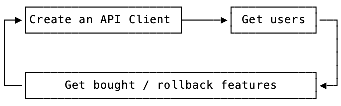

## start of the fall: postman

Postman started out pretty good. For that period of time, it was actually _really good_, especially compared to its other cross-platform competitors. But overtime this soured. Licensing restrictions, forcing features that compromise user data security, and ramping up their overall costs. [One user](https://news.ycombinator.com/item?id=40418562) reported their company went from paying $72 per year to $1,188 per year... yikes. Not only do users **not** want all of their data accessible by the small tool they're using for API testing, but they don't want to be bled dry for that privilege as well. _Surprise surprise_.

Postman made it impossible for security researchers and penetration testers to do their jobs, as they **are not** going to upload their client's or target's data to an unencrypted cloud for "safekeeping".

## a hero swoops in: insomnia... for a little bit

Insomnia rose from the ashes of Postman when its user base imploded due to the changes they were making. Promising open-source, no accounts required, no cloud requirement, tons of people flocked to it. Kong then acquired them... and yeah, the rest is history.

## the cyclical fragmentation of the ecosystem



Too many tools go through the _extremely oversimplified_ cycle shown above. A pivot to increase profitability sucks, even if it's required to stay afloat. At that point sometimes they have to start getting creative and do things like going back on promises, adding account requirements, changing the license, and rolling back features. Once a user or team has settled into a tool, they don't want to pick everything back up again and be forced to leave.

---

## what are some other options?

There has been a flood of new options over the last few years, but only a few of them really stick out. Sometimes its okay to stay dead simple; just a client that sends and receives requests. But other times teams want a little more in order to save time and make their lives easier. I've taken a look at a few popular suggestions below. You will notice though, quite a few of them do things _extremely differently_ than the others.

### hurl

I'm going to state my bias here: I **really** like [Hurl](https://hurl.dev). It's stupid simple, has great scripting utilities, and the ability to go from 0 -> 100 with it comes after just a few hours. The most complicated part, which was still not very complicated, was getting used to capturing values. On MacOS, you're only one command away from using it:

```bash
brew install hurl
```

If you've ever seen HTTP requests & responses (if you're reading this, I hope you have), then the syntax will come naturally to you:

```bash
# Get home:
GET https://example.org
HTTP 200
[Captures]
csrf_token: xpath "string(//meta[@name='_csrf_token']/@content)"


# Do login!
POST https://example.org/login?user=toto&password=1234
X-CSRF-TOKEN: {{csrf_token}}
HTTP 302
```

It's got great potential, and is one _really nice_ GUI wrapper away from mass-adoption.

### yaak

> The reason I started Yaak was because of what happened after I sold it. What makes you think I'd do that again?
> ~ [gschier](https://news.ycombinator.com/item?id=42898145)

Yaak is an API testing tool that's been bootstrapped by the creator of Insomnia. After seeing Insomnia turn on its users and contributors, it looks like he's diving right back in to give it another shot. His pricing and docs reflect his philosophy surrounding a [sustainable](https://yaak.app/blog/commercial-use) but useful API client:

> Commercial-use licensing operates on the honor system—I trust you to decide if a license is right for you. The goal is sustainability, not barriers and purchasing a license helps ensure Yaak’s continued growth and improvement.

So let's dig into commercial use real fast:

> Commercial Use: A paid license is required to use Yaak’s prebuilt and signed binaries for revenue-generating or work-related activities within for-profit organization of two or more people

The code itself, including the build scripts, is MIT licensed, so the only difference between paid vs. free is downloading it from the site. There are some extra features thrown in:

- direct support
- prioritized feedback
- prebuilt and signed binaries
- automatic updates

Booting up the presigned binary for the first time presents you with a clean slate, so I have to give kudos for that! I love not getting bombarded right off the bat.

Let's jump into building it myself. Using NodeJS, Tauri, and Rust, it's a very unique combination. The process ]to download everything it needed and get it to run from the source code took about 10 minutes. The first build took 5 minutes, so not abysmal.

There's a walkthrough that tells you how to build it in [GitHub](https://github.com/mountain-loop/yaak/blob/master/DEVELOPMENT.md). Basically just ensure you have rust, npm, and node, then:

```bash
npm install

npm run bootstrap

npm start
```

And then if you want to build your own binary run:

```bash
npm run app-build
```

Checking the signing info of the presigned Yaak binary downloaded from GitHub with [What's Your Sign](https://objective-see.org/products/whatsyoursign.html) shows that it is validly signed and notarized. Checking the binary I built from the instructions shows no entitlements and that it also contains signing issues (expected, as I built it myself). When opening the self-built binary a "Personal Use" badge can be seen in the top right corner, and when clicking on it a new window appears to a license page saying "You have 14 days remaining on your trial". In the same window it says "**Personal use and running the open-source code directly require no license**".

I'll admit that at this point I'm a little confused, does it literally mean that the MIT Licensed code that includes the build steps is okay to be run with `npm start`, but building an unsigned binary with `npm run app-build` is a bridge too far? Their FAQ shows that they aren't looking to enforce their restrictions, but I'd want to make sure I'm not running afoul of their products intended usage.

> Yaak relies on users to self-assess whether a license is appropriate for their use case. This system focuses on sustainability over enforcement.

With the extremely small scope of features (albeit it's in beta) and a level of doubt surrounding the long-term possibilities of monetization being successful, Yaak doesn't _currently_ appear to be a successor, but I'd keep an eye on it.

### Bruno & Bruno's CLI

Bruno's UI and feature set is the (I'd say) the closest to Postman in terms of being "complete". I'm sure there are some items missing, but it runs decently and supports commonly used items like variables, pre/post scripting, its form of collections, and much more.

Bruno's [Bru Lang](https://docs.usebruno.com/bru-lang/overview) is kinda whack though, _in my opinion_. I'm a JSON hater though, and think it should only be used when it's the best option for something. When it comes to writing scripts to execute requests, capture items from responses in a multitude of ways, and pass them forward to be used in further requests, it seems lacking. If I'm not mistaken, it looks like it can also only capture values stored in JSON from responses? I'm not sure on this, but from the docs that seems to be the only example of a capture.

They have a [pricing model](https://www.usebruno.com/pricing) that includes things like support, and 290+ contributors and 30,000+ stars on [GitHub](https://github.com/usebruno/bruno), so it they don't seem to be going anywhere! In terms of ready-to-use alternatives that have a solid GUI option, this would be the best bet. If you'd like to utilize more robust scripting and don't care for a GUI, I'd suggest Hurl.

### HTTPie & HTTPie CLI

[HTTPie](https://httpie.io/desktop) itself seems pretty solid. I'd say very similar to Bruno, with less features. The CLI is pretty easy to use and get started with, but doesn't have as many opportunities for scripting and automation as Hurl. It does have a simple syntax which is nice, where with Hurl sending one-off requests is a little more complicated and needs the use of extra commands. It also has a browser-based app.

There doesn't appear to be any current monetization, and the [CLI](https://github.com/httpie/cli?tab=BSD-3-Clause-1-ov-file) is OSS and BSD-3 licensed, whereas the desktop app uses a custom license and isn't OSS.

---

## some tools won't reach mass adoption

That's just the truth, and it's totally okay that they might not gain industry-wide adoption. They'll have their loyal fans and contributors, and can continue to make money and have a small team until maybe one day they get acquired, or they just persist. Not everything needs to be a VC-fueled frenzy.

I'd actually argue that bootstrapping would be the best way to go for a tool like this, because it wouldn't force you to potentially need to make decisions that would hurt your users, or your brand's reputation. This kind of tooling doesn't need to be some complex behemoth that does a billion different things _ok_, it can be a honed knife that does a few things _amazingly_.

If someone comes from another tool and uses the new one, they should say **wow**[^1], this is way better.

[^1]: I actually said this when I first opened Yaak. It was just _so clean_, and it was nice not get bombarded with pop-ups and a setup process.

## core feature requirements

These are items I think are essential to an API tool. There's a decent chance I missed some things, or removed items I've changed my mind about, so this post may change as time goes on.

### a gui is non-negotiable for mass adoption

Anything that _relies_ on a GUI and won't work without one isn't going to be the end-all-be-all pick. If the individual requests can't be easily edited and run by themselves via the CLI, I don't think it's the right fit. It might get popular, but it won't be _the_ API client.

A GUI is needed though, as it's more than just the normal devs using these collections of requests. It's QA, vendors, and sometimes even your customers. If something without a GUI was the right choice, everybody would have looked at cURL and said "good enough" and moved on with their lives, but yet there's still a massive demand for these types of tools.

### the underlying tech should be OSS

This will probably be brought up more than once, but the engine / core system should essentially be a CLI program that is free to use. Not only does it assist users in feeling safer in their choice, knowing that no matter what, they can keep this in their CI/CD pipeline and their collections can be run wherever. It also helps with publicity, feedback, and could end up being in some setups distributed-by-default if it's an extremely useful utility.

### support any import, then only support web-standard export

Making it frictionless to join from another tool is a great option to encourage users to make the switch and try out their existing request collections in the new tool. As the ecosystem continues to fragment these new tools should reinforce the standards though. Each tool now has its own way of doing things when it comes to saving these collections, and it's getting out of hand.

That's why export should only support a few standards, like OpenAPI (any version), cURL, Hurl, HAR, and WSDL. Then allowing users to import more opinionated collections like from Postman or Insomnia, in addition to the already mentioned ones.

### have an enterprise version, but some kind of free tier is inevitable

To get enough traction for adoption, users need to be able to quickly download, install, open, and run a request without any hurdles. Account creation should be an afterthought for them. If a dev shoots a message to a vendor's QA team and attached a collection of requests with a tool they don't use, that team shouldn't need to buy a license just to be able to _run_ those requests.

That's where things get interesting. Questions need to be asked like:

- What functionality should free users have access to?
- What should the pricing system look like?
- What level of functionality would stop a corp from needing the enterprise version?

### support the one-off users, sway them to your product at the same time

A lot of users may pick up your product to use because a customer or vendor requires it, as they may utilize certain environment setups or pre/post request scripting that would break when imported into other tools. These features are not supported in all API tooling, and a lot of them have their own "flavor" of syntax they use for it. Some use normal JS, others use JS with custom processing and variables, then even more might use a language like Python for pre/post request scripting.

This is a great opportunity to have a carve out in your licensing for that solo operator / small team to use your product. Take this time to impress them! Show them how clean the UI is, how fast it runs, how simple the processes are, and how easy it is to use. If you can't support these one-off enterprise users, how will the product ever really grow to mass adoption without being open-source?

### the gui-version probably shouldn't be oss, but the format & core system should be

Imagine the scenario where the open-source community / personal use version of the application gets a [pull request](https://github.com/hoppscotch/hoppscotch/pull/3266#issuecomment-1984106576) that implements certain features the app's team want to reserve for their enterprise customers. Denying it doesn't look great, but you can't accept it either. You don't want your business model to morph into chasing down enterprise customers for breaking licensing agreements and dragging them into court.

Users don't want to be locked-in either. If they don't like your tool, that's totally fine, but larger teams might be wary of moving to a new tool in the first place if it uses some proprietary / painful system for the management of their data. Enabling easy onboarding and offboarding reduces the risks and investment teams need to endure to do rollout tests with your application.

**OSS is great**, and I'd encourage anyone to go that route, but make expectations clear in the beginning that the OSS version won't be competing with the enterprise version on features. A lot of users feel bait-and-switched after an acquisition or post-enterprise version rollout.

This is why it _might_ be the correct route to **not** go OSS, depending on the business model. The underlying systems and formatting should be though; embrace and contribute to OpenAPI and its tooling, and allow your customers to run their collections via the CLI no matter what, even if they don't feel like paying for the GUI anymore.

### secure pre/post scripting

A.K.A. not Python, not JavaScript, and not Go. While being extensible these implementations can introduce some nasty potential security issues into projects (especially when `npm` is involved) and some even make the project much heavier. **Hurl** has some great examples of simple scripting to meet a large variety of needs, but the main focus of retrieving values through different methods, assigning them to variables, and passing them further down the chain to be used is supported.

Developers already face issues running random repos and libraries and having to trust them not to be compromised and throw an infostealer on their computer, let's not add their API tool to the list of things they need to worry about.

### scope variables & secrets storage (and sharing)

Everyone's got secrets, no one wants to share or store them insecurely. Differently scoped variables are also super useful, especially when combined with scripting multiple requests.

### git-friendly requests, collections, and configs

Being git-friendly is where skimming, and potentially doing edits, to the files being pushed and pulled from the git forge isn't an absolute pain. No one wants to look at some file and it just be completely unreadable or an insane JSON monstrosity. The layout can _easily_ be standardized, and if there's some product-specific metadata that supports features only your app has, that's totally fine, but don't intertwine it with the underlying collections and requests. Create your own YAML/config/db/whatever to track those features, their values, use, etc.

I'm a known lua config hater (looking at you neovim), but I understand more dynamic configs have their place in the world. An API tool is one place I don't think configs should be complicated. As easy as JSON can be to work with as well, I consider the peak of config design for a simple app to be [Ghostty's](https://ghostty.org/docs/config). It's dead simple, easily readable, and for the most part there's no formatting quirks that could bite you down the road from making small edits.

### works offline

It's a great feature to have. Some might think "works offline, but still requires a license check-in every two weeks" and I say "no". For the free scratchpad that's a great idea, but for the paid one, that's a killer feature that people, especially in government, would love. There's a surprising amount of work done in environments that will **never** connect to the internet.

If you have a SaaS structure, you could do offline verification of licenses or product codes. If you have the option of buy-it-once, then that can be implemented in a similar way as well.

### cross-platform

It should go without saying, but if you want as many people as possible to use your tool, it should target all platforms. While developing solely for MacOS only _would_ be nice, Windows and Linux need to be taken into account as well. For the best experience possible, I'd start on MacOS with SwiftUI with its own codebase, then launch a Windows/Linux version that share a codebase once the MacOS app is polished.

### use the native UI, not a webview

While Electron / Tauri are nice for having one codebase, you can just _tell_ they're made with them. The same goes for apps created with React Native. This also can be summed up by saying: **Use as little JavaScript / TypeScript as possible**. It's bloated, it includes a ton of unneeded things, and just looks **bad** most of the time. I _have_ seen good looking apps made with these tools, but they are very few and far between, and their performance usually still leaves room for improvement.

### wide variety of protocol support: http, grpc, graphql, etc.

A given... since you're working with APIs.

### auth support: oauth, basic auth, etc.

Another given... because API 🤷‍♂️.

### maintain a healthy contribution policy if going OSS

Another thing I liked about Yaak was their [contribution policy](https://github.com/mountain-loop/yaak?tab=readme-ov-file#contribution-policy):

> Yaak is open source, but only accepting contributions for bug fixes.

This allows them to avoid the issue of pissed off users if a contribution is denied due to infringement on a current or future enterprise (paid) feature.

### a cli that can handle all of the files generated by the gui

Nothing is worse than a CLI component that only works with a specific portion or functionality from your features. The CLI component is most likely going to be the underlying _core system_ that was mentioned above. Companies in turn will most likely be implementing it in their CI/CD pipeline, or devs that dislike using GUIs in general will prefer it over the standard application.

### leave support for deprecated tech & standards in the dust

If the teams supporting those monoliths want to use newer tools, they can drag their monolith into the modern age. Older tech and standard _can_ be supported, but I wouldn't prioritize it. Target the features the largest audience wants first, then the second largest, and so on.

---

## nice to have features

Whether these are paid or not, they've began to be things people expect or have requested. Ofc, this isn't all encompassing.

- copy as cURL
- custom plugin support
- optional e2e cloud-sync
- p2p live shared workspaces via HTTP or SSH
- password protected collections
- proxy capability
- in-app git sync integrations
- customizable quick-action toolbar to fire off flows
- a command palette
- autocompletion
- mdn summary for headers on long-hover, same with header's directives
- logging / request history
- comments / descriptions
- easy handling for uploading a file
- header filters - ability to still have, but not have to see, specific headers
- jwt reader & editor
- most tooling and features to have some level of customizability or have the ability to turn them off
- allow an option for requests to still attempt to be sent even if they're "broken"
- keyboard shortcuts... for everything
- MacOS Keychain storage for secrets
- a cookie jar
- common package manager support (like Homebrew)
- support HTTP/2
- raw view to see exactly what is being sent and received

## a healthy way to create a free-tier

Both of the options I'm putting forward should be stated off the bat as the projects free tier and method of monetization should be clear to any user that goes hunting for that information. No matter what though, the docs should be fleshed out to the point that each user knows via writing & photos exactly how each feature in the application works.

### non-saveable project state

This would focus more on throwaway requests and act as a "scratchpad".

### 15-day internet-required and cloud-sync'd free trial

Allows them to get a feel for the tool but forced restrictions they can avoid by paying for the full version. A lot of people don't want to need an account, would like to use it in internal offline settings if they need to, and don't want company documentation and API information going into a random cloud.

---

## things to avoid

This is a very limited list, but contain some of the pitfalls I've observed.

### overcomplicating it

It's a **collection of requests**, let's not get too far outside of it being exactly that. It isn't the place to rely on for everything involved in testing the app. Unit tests, mocks, etc. belong in the code itself for the project. Adding these things in requires a quite a few more features and edge-case support that complicates and adds bloat to the application.

This tool is supposed to be able to be used by a junior dev / QA'er without needing to deep dive into the docs and settings. **Keep the features visual if you can**. Users needing to do too much with scripting is a negative.

### prioritizing the wrong things in the roadmap

The key is to be as useful as possible to the largest audience possible. You might have a vocal minority of free users screaming for grpc support, but you haven't implemented graphql support yet. Even though you're getting yelled at for grpc, graphql would make more sense to do first. **Make logical decisions surrounding impact**.

### burying options and actions

There's nothing worse than having to click and scroll five different times to reach a simple core functionality of an application.

### busy UI

Complicated, hard to get used to using, awful when starting up, etc.

### forced cloud-sync

Company data does not belong in random cloud storage, especially not unencrypted.

### removing / pay-walling features later on

Create a plan and stick to it. Be clear on your feature roadmap from the beginning for the free vs. paid versions. If possible, have the free version completed so that it essentially never has to change.

### defaulting to render view / putting too much importance on it

Bundling what is essentially a browser in an app is an easy way to make things way too complicated (again).

---

## my personal want

1. The scripting of Hurl.
2. The command line syntax of HTTPie CLI.
3. A sleek SwiftUI GUI that follows the Apple HIG.
4. The maintainability, simplicity, and interoperability of Go.
5. Fully embrace OpenAPI standards.

> Why features from both Hurl and HTTPie CLI?

One is great at scripting, one is better via the command line. They both have their quirks, but I think a combination of them would make for a great underlying system for the GUI application.

> Why SwiftUI?

Some of the best looking and useful apps I've seen have been written in SwiftUI. I've seen a lot of other beautiful apps built in other ways (like Electron), but once you used them it was _not so great_.

> Why an OpenAPI?

The backbone of API documentation and it continues to have great additions and support across the industry. It can natively support a lot of the features mentioned above without having to create extra files.

---

## the king is dead, long live the king

Will any tool be "just right"? I don't think so, because they're all trying to do too many things. Going to program to program and attempting to take your collections with you just highlights what things are missing that had been utilized previously. Scope creep is real, and needing one single API testing tool to do _everything_ perfectly is nuts.

## honorable mentions / other options

- [posting](https://posting.sh)
- [RapidAPI / Paw](https://paw.cloud)
- [Kreya](https://kreya.app)
- [JetBrains Plugin](https://www.jetbrains.com/help/idea/http-client-in-product-code-editor.html)
- [Thunder Client for VSCode](https://www.thunderclient.com)
- [REST Client for VSCode](https://marketplace.visualstudio.com/items?itemName=humao.rest-client)
- [xh (CLI)](https://github.com/ducaale/xh)

## CLI

This section is mainly for me to track cool-looking CLI projects that do request and response handling.

- Hurl
- xh
- HTTPie CLI
