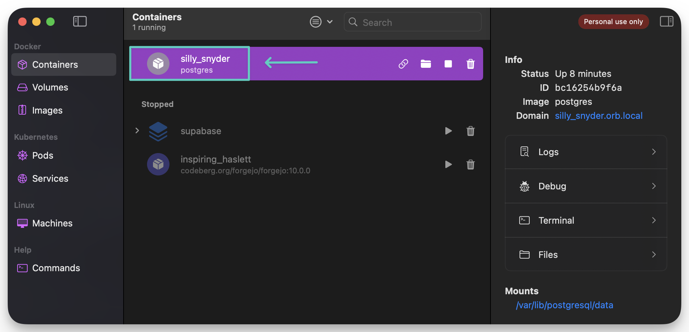
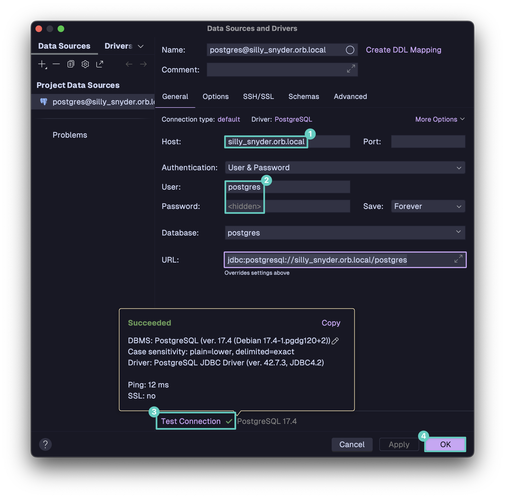
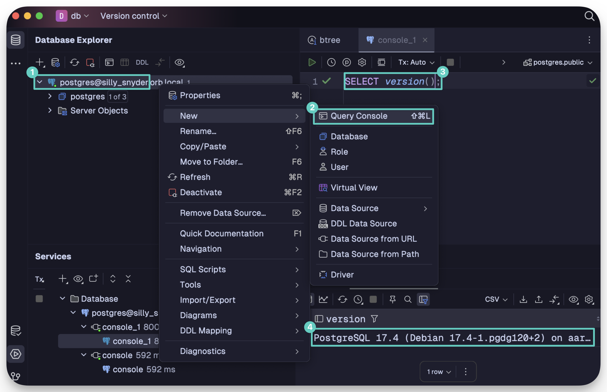
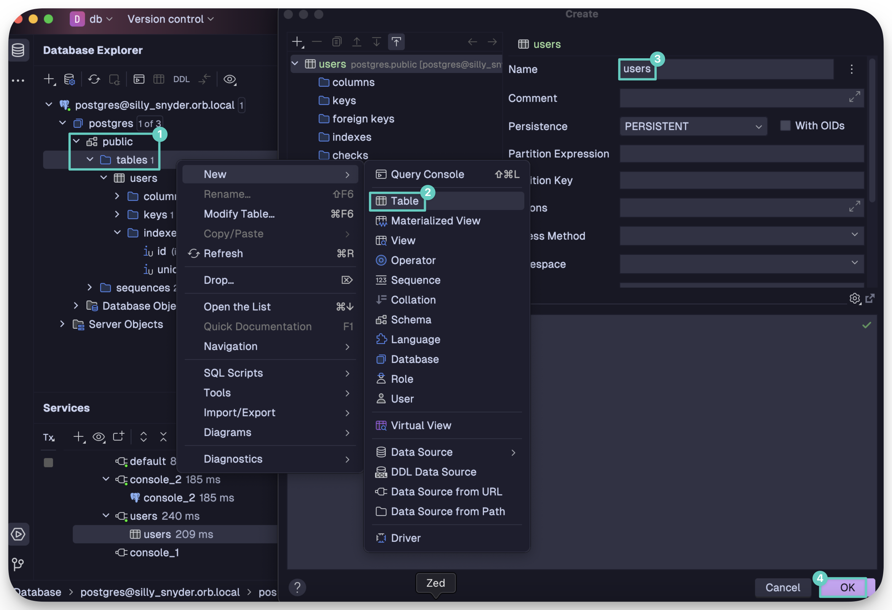
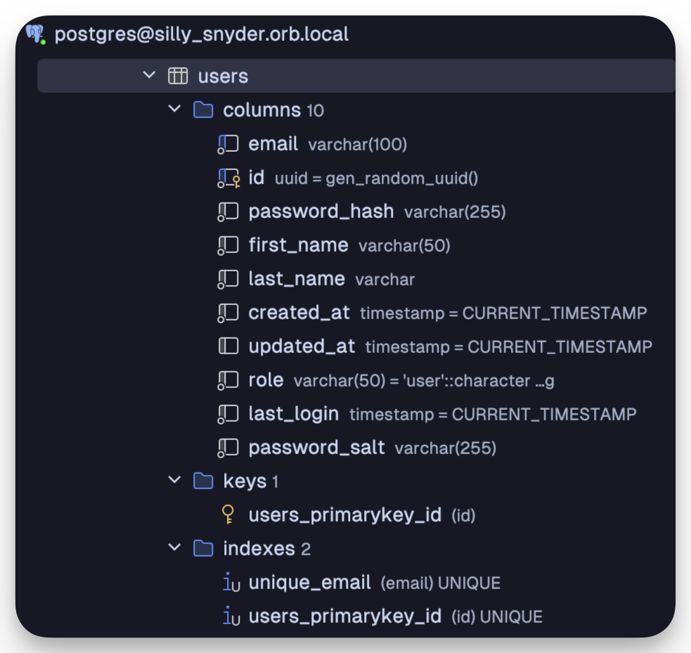
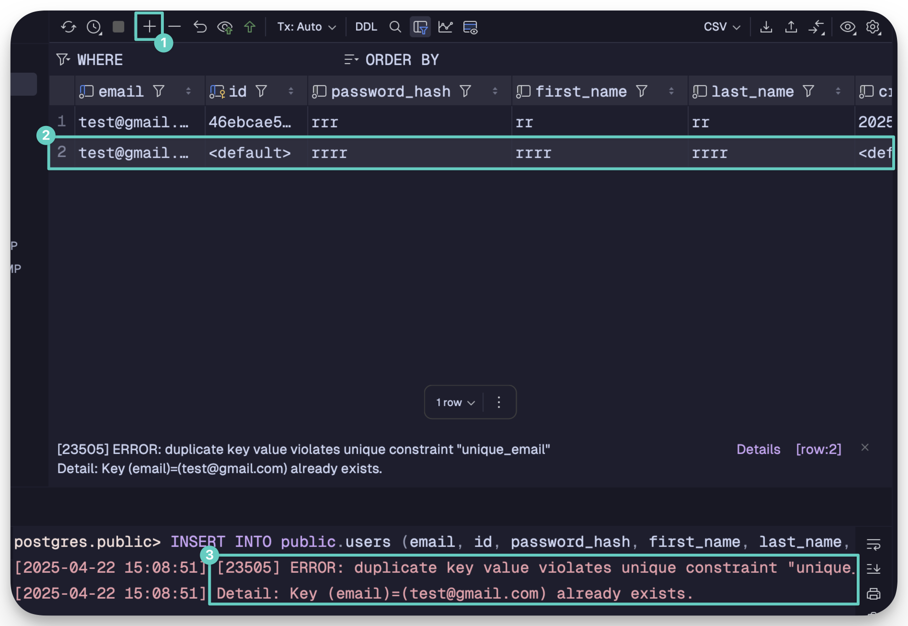

## pre-reqs

Have these programs installed and running. Ensure you can get a container running with orbstack.

- orbstack
- datagrip
- docker

## pulling the docker image and verifying it's running in orbstack

Run these:

```bash
docker pull postgres

docker run -e POSTGRES_PASSWORD=< password > postgres
```

Then navigate to orbstack and make sure it's running:



## connecting to postgres with datagrip

OrbStack creates a local domain name to access your containers, so there's no need to worry about ports (unless you want to, there's extra options for that). For example, the auto-assigned one in this instance is `silly_snyder.orb.local`.

Open DataGrip and add a connection to a Postgres instance. The end URL will look like this: `jdbc:postgresql://silly_snyder.orb.local/postgres`. Ensure that the default user is selected (normally `postgres`) and enter the password you chose from the `docker run` command. Then select `Test Connection` to ensure everything is working.



Run a query in DataGrip to ensure everything's working:

```bash
SELECT version();

PostgreSQL 17.4 (Debian 17.4-1.pgdg120+2) on aarch64-unknown-linux-gnu, compiled by gcc (Debian 12.2.0-14) 12.2.0, 64-bit
```



Now it's time to verify the connection using `pgx` version 5 in a golang program.

## checking the connection via a golang program

Here's a small program that will connect to the postgres instance running via orbstack and output the version query's result to the console.

**Go Code:**

```go
package main

import (
	"context"
	"log"

	"github.com/jackc/pgx/v5"
)

func main() {
	connStr := "postgres://postgres:< password >@silly_snyder.orb.local/postgres"

	conn, err := pgx.Connect(context.Background(), connStr)
	if err != nil {
		log.Fatalf("Failed to connect to the database: %v", err)
	}
	defer conn.Close(context.Background())

	// Example query to test connection
	var version string
	if err := conn.QueryRow(context.Background(), "SELECT version()").Scan(&version); err != nil {
		log.Fatalf("Query failed: %v", err)
	}

	log.Println("Connected to:", version)
}
```

**CLI Output:**

```bash
go run main.go

2025/04/22 13:31:49 Connected to: PostgreSQL 17.4 (Debian 17.4-1.pgdg120+2) on aarch64-unknown-linux-gnu, compiled by gcc (Debian 12.2.0-14) 12.2.0, 64-bit
```

## why datagrip

First, you might ask "why datagrip?", as some things might feel annoying / unfamiliar if one hasn't worked with a program like it before. Why not use an ORM or something higher-level to abstract away needing to mess with sequences, indexes, etc. in a lower format? Especially when some options even have pretty-GUIs that can be used in other programs.

The main reason is familiarity and standards. The tools that attempt to abstract away those issues won't do you any good in edge-cases, where you'll need to get down and dirty and be super familiar with not only SQL, but the program you're using as well. DataGrip is one tool that _essentially_ can do everything you need (along with a few others). I want to learn as much as possible about the tools I use, and ensure they're following standards and won't contribute to being locked-in to a specific setup.

## create a users table in datagrip

Create a new table that we can store users in. Remember that each part of this can later be changed, so don't be afraid to experiment as well.



After adding all the needed columns, the sidebar should look something like this.



Then adding a row with a duplicate email address and attempting to `Submit` it should result in an error.



---

That's it!

It's off to a decent start for now. I'd say this is MUCH easier than going through the pain that is attempting to self-host Supabase.
