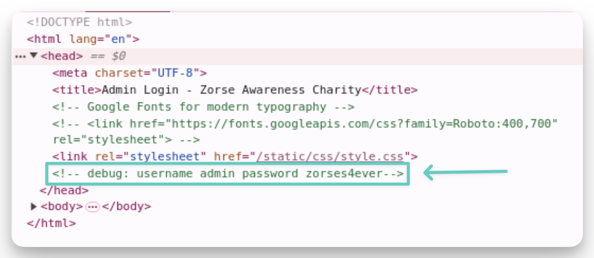

## web

### zorses awareness - ✅

Entering the challenge via a virtual desktop in the browser, I was greeted with a web page. Right-clicking and attempting to `View page source` resulted in getting an error message stating that "Your organization doesn't allow you to view this site". Luckily you can still `Inspect`. 

Clicking the admin login link in the top-right of the home page, then inspecting the login page shows the username and password in the HTML via comments:

### financial data breach!

A financial report was revealed early on accident. Checking the previous financial reports via the site's source code, they link to download a `.pdf` version with a predictable filename (essentially `quarter_3_report.pdf`). Changing this name to `quarter_4_report.pdf` reveals the leaked report.

### glitchtrack

The bug tracker performs a POST request using JS to authenticate the users. Removing the password from it allows a successful request, and you can just one of the usernames of the bug creators from the site's front page.

A network request to an API reveals the admin:

And it looks like he has something special in his secure notes:

## password cracking

### password cracking - 5

Luckily CrackStation had it 😅🤝.

## ai + tools

### ai tool abuse - intro

---

## things to do to be ready for next time

- Have password cracking tools setup with examples / cheatsheets ready.
	- I haven't cracked passwords in a while, and didn't have any password wordlists on my laptop. Nor did I have johntheripper, hashcat, keepass2john, ansible2john, etc. setup.
	- Create some Go-based scripts that automate web searches for it.
		- Crackstation, Google, IntelX, etc... Probably worth it to look for some more sources.
	- Be ready to crack:
		- Keepass (both old and new vault formats)
		- Ansible Vault
		- Look over and get familiar with the other conversion scripts that might be utilized [here](https://github.com/openwall/john/blob/bleeding-jumbo/run/ansible2john.py).
		- Passwords with salts
- Have a better work around than using Guacamole in the browser for web challenges.
- Get more used to going up against LLMs that have access to tools and different sanitizers, from both input and output sanitization.
	- Dreadnode / Crucible challenges would be a good practice ground.
- Look into Jenkins, Dune, and OCaml exploitation.