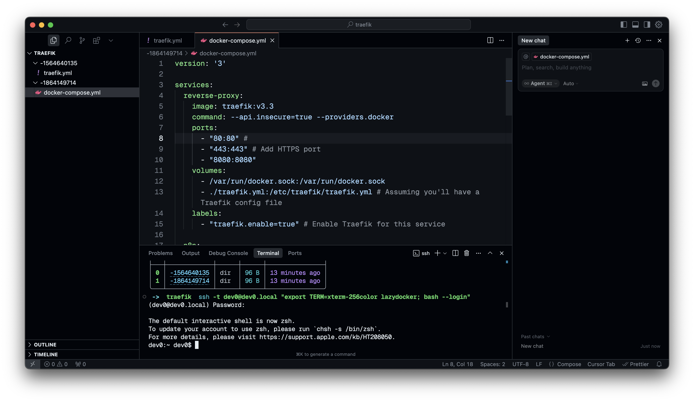
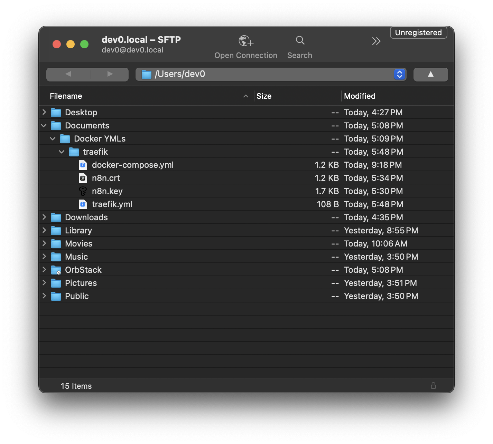

## enable remoting on the mac mini


## install and configure tailscale on two systems

1. Navigate to the [tailscale](https://tailscale.com) site and download the application.
2. Walk through the installation instructions for your server, they are straightforward.
3. Walk through the instructions to set it up on one of your clients as well.
4. 

## create a the traefik YML & docker-compose YML

1. Run `docker run -d -p 8080:8080 -p 80:80 \ -v $PWD/traefik.yml:/etc/traefik/traefik.yml traefik:v3.3`.


## access the filesystem via sftp & ssh in for running commands

You don't want to be using a GUI via `Screen Sharing` the whole time while remoting in, as it can get pretty slow and grainy if your internet isn't a decent speed. SFTP and SSH are our friends here.
### ssh

Find out what terminal type you're using and make sure it's stated when connecting via `ssh`. This makes sure you have all your commonly utilized terminal tools supported (like tab-complete).

In the below command, I'm using `xterm-256color lazydocker` because I use [Ghostty](https://ghostty.org), and apparently this is the [workaround](https://github.com/jesseduffield/lazydocker/issues/610) for now.

```bash
ssh -t < user >@< machine > "export TERM=xterm-256color lazydocker; bash --login"   
```

A handy flow is to have an IDE open and connect via the in-IDE terminal using SSH.



### sftp

1. Use the CLI or download a GUI-based program to connect to the remote filesystem. In this instance I'm using [Cyberduck](https://cyberduck.io). 
2. Open it up and make a connection to your server. In my case I just used the name of my server (`dev0.local`). 
3. Use the username and password for the account on the Mac Mini / server.


4. From within Cyberduck you can `Right-Click > Edit With > Code` on files, which will then open them in an IDE / program such as VSCode. Changes will automatically be synced to the remote filesystem from your local computer as long as Cyberduck is connected.