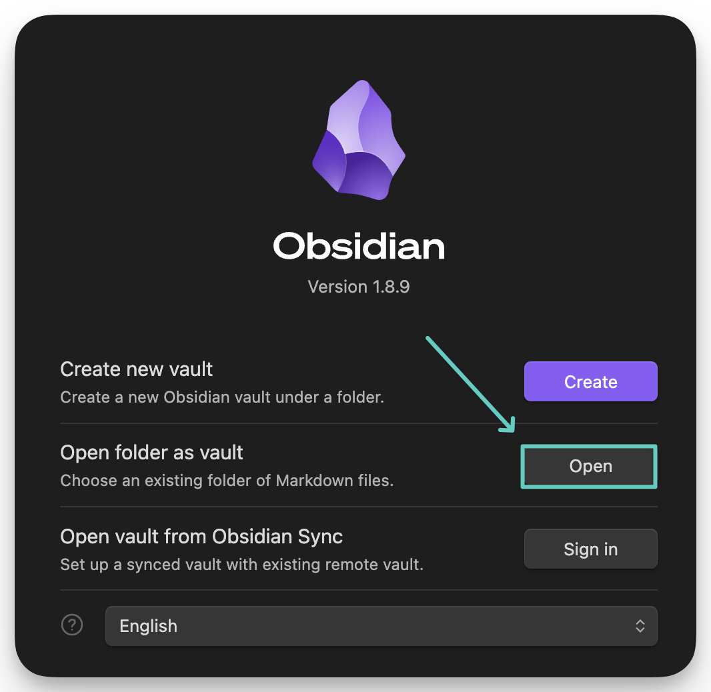

**Prerequisites:**

- A working [GitHub pages](https://docs.github.com/en/pages/quickstart) website.
- [Obsidian](https://obsidian.md) installed on your computer.

**How To:**

1. Navigate to the directory that your blog stores its `.md` or `.mdx` files in (the content), and note the directories path to be used later.
This may be something like `/Users/< user >/Documents/GitHub/< user >.github.io/src/content/blog`.
2. Open Obsidian and select `File > Open Vault` from the menu bar.
3. Select the "Open Folder as Vault" button from the menu that appeared.

4. Select the folder full of your markdown files. This will create a new Vault.
5. Open a file up and start editing! Feel free to use whatever Git tooling you'd like:
	- GitHub Desktop
	- Git CLI
	- IDE Extension
	- Etc.

**Tip:** Obsidian uses wiki-links by default. This doesn't work (at least for me) out-of-the-box with my Astro site. Turn off the usage of wiki-links and it will default to using the standard markdown image insertion. 

